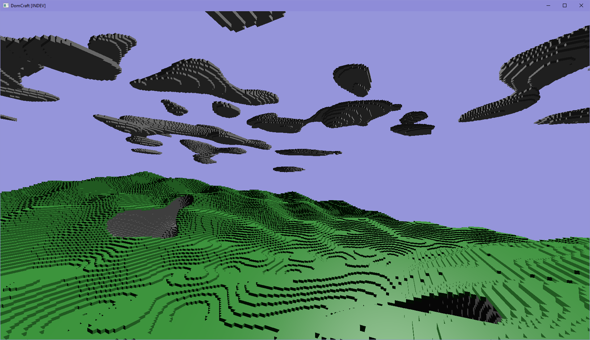

# Domcraft

A small Minecraft-like simulation written in Rust. This is one of my personal projects that I work on in my free time.

## Building

### Prerequisites

- The **Rust toolchain**, **Cargo** and **rustc compiler**, which can be downloaded from [the official website](https://www.rust-lang.org/tools/install).

- A computer with graphics cababilities (a GPU that can run Vulkan is recommended).

- Windows or Linux (MacOS might work, but hasn't been tried). *Note for Linux users: Running Domcraft on a Wayland session may result in display bugs.*

### Compiling and Running Domcraft

First clone the repository using `git clone https://github.com/Dominically/Domcraft.git` and then enter the directory with `cd Domcraft`.

Running `cargo run --release` will compile and run Domcraft in one step, but the first compilation will take a long time. If you do not wish to run Domcraft straight away, use `cargo build --release` instead.

### Cleanup

The Cargo build tool can create a lot of files, so make sure to run `cargo clean` to remove temporary build files (but the first build after this will take longer than usual).
